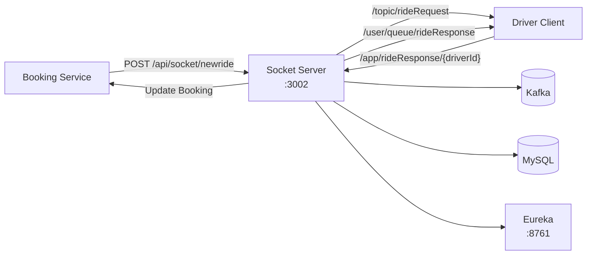
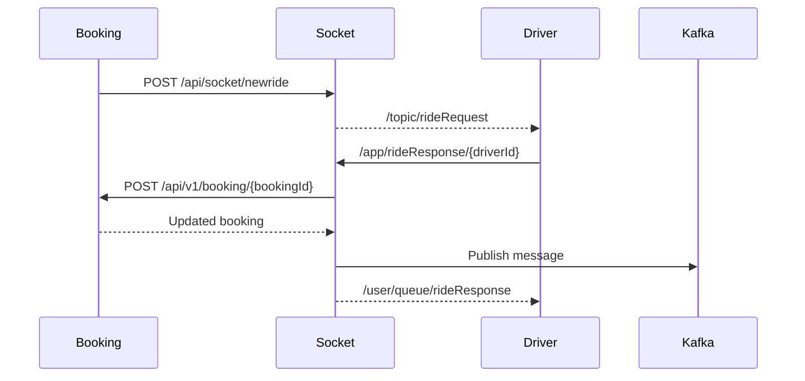

# RideFlow Socket Server

RideFlow Socket Server provides the real-time messaging layer for the RideFlow platform.

It bridges normal HTTP requests from Booking Service into STOMP/WebSocket messages that connected driver clients can receive instantly.

It also processes driver responses, updates Booking Service, and sends a per-user acknowledgement back to the driver.

---

## Runtime

| Property              | Value                      |
| --------------------- | -------------------------- |
| Application           | `SocketServer`             |
| Port                  | `3002`                     |
| Real-Time Messaging   | STOMP + WebSocket + SockJS |
| Service Discovery     | Eureka Client              |
| Kafka                 | `localhost:9092`           |
| Database              | MySQL / `uberdb`           |
| Shared Entity Version | `0.0.7-SNAPSHOT`           |
| API Documentation     | Springdoc OpenAPI          |

---

## What This Service Implements

* REST endpoint to receive ride requests
* STOMP/WebSocket broadcasting
* SockJS fallback support
* driver ride-response handling
* per-user WebSocket acknowledgement
* Booking Service callback
* Kafka producer/consumer integration
* Eureka registration
* Swagger/OpenAPI documentation for REST endpoints

---

## High-Level Architecture



---

## Complete Ride Messaging Flow



---

## Swagger / OpenAPI

Swagger documents the REST-facing part of Socket Server.

Swagger UI:

```text
http://localhost:3002/swagger-ui.html
```

OpenAPI JSON:

```text
http://localhost:3002/v3/api-docs
```

OpenAPI YAML:

```text
http://localhost:3002/v3/api-docs.yaml
```

Current Swagger path coverage:

```text
/api/socket/**
```

> STOMP destinations such as `/topic/rideRequest` and `/app/rideResponse/{userId}` are messaging contracts, not REST endpoints, so they are documented separately below.

---

## REST API Base Path

```text
/api/socket
```

Current REST endpoints:

| Method | Endpoint              | Purpose                      |
| ------ | --------------------- | ---------------------------- |
| GET    | `/api/socket`         | Kafka smoke-test endpoint    |
| POST   | `/api/socket/newride` | Broadcast a new ride request |

---

# 1. Kafka Smoke-Test Endpoint

Endpoint:

```http
GET /api/socket
```

Current behavior:

```text
HTTP Request
    ↓
Publish "Hello"
    ↓
Kafka topic: sample-topic
```

Response:

```json
true
```

This endpoint is mainly useful for verifying that the Kafka producer can publish a message.

It is not intended to be the application's health endpoint.

---

# 2. Receive New Ride Request

Booking Service sends a ride request to:

```http
POST /api/socket/newride
```

Example request:

```json
{
  "passengerId": 1,
  "driverIds": [
    201,
    202
  ],
  "bookingId": 19
}
```

Expected response:

```json
true
```

---

## Ride Request Flow

```text
Booking Service
      ↓
POST /api/socket/newride
      ↓
DriverRequestController
      ↓
SimpMessagingTemplate
      ↓
/topic/rideRequest
      ↓
Connected Driver Clients
```

---

## Ride Request Destination

Connected drivers subscribe to:

```text
/topic/rideRequest
```

When Socket Server receives a new ride through the REST endpoint, it broadcasts the `RideRequestDto` to this destination.

Example driver-received payload:

```json
{
  "passengerId": 1,
  "driverIds": [
    201,
    202
  ],
  "bookingId": 19
}
```

---

## Important Current Broadcast Behavior

Although `RideRequestDto` contains:

```text
driverIds
```

the current implementation does not use those IDs to send the ride only to specific drivers.

Instead:

```text
RideRequestDto
       ↓
/topic/rideRequest
       ↓
All subscribed driver clients
```

So currently the ride request is broadcast to every connected subscriber.

Targeting only nearby drivers is a future improvement.

---

# WebSocket / STOMP Configuration

Socket endpoint:

```text
/ws
```

Full local endpoint:

```text
http://localhost:3002/ws
```

The application uses:

```text
STOMP
+
WebSocket
+
SockJS
```

---

## Application Destination Prefix

Messages sent from a client to application controllers use:

```text
/app
```

For example:

```text
/app/rideResponse/201
```

---

## Broker Destinations

The simple message broker supports:

```text
/topic
/queue
```

Typical usage:

```text
/topic
    → broadcast

/queue
    → point-to-point / user-oriented messaging
```

---

# Driver Subscription

A driver should subscribe to:

```text
/topic/rideRequest
```

to receive ride requests.

A driver should also subscribe to:

```text
/user/queue/rideResponse
```

to receive the result of their own ride-acceptance operation.

---

# Driver Ride Response

The driver responds through:

```text
/app/rideResponse/{userId}
```

Example:

```text
/app/rideResponse/201
```

where:

```text
201 = driver ID
```

Example payload:

```json
{
  "response": true,
  "bookingId": 19
}
```

---

## Driver Response Flow

```text
Driver
   ↓
/app/rideResponse/201
   ↓
DriverRequestController
   ↓
Extract Driver ID
   ↓
Create UpdateBookingRequest
   ↓
Call Booking Service
   ↓
Booking assigned
   ↓
Build RideAcceptanceResponseDto
   ↓
/user/queue/rideResponse
```

---

## Booking Update Request

When a driver responds, Socket Server creates a request conceptually similar to:

```json
{
  "driverId": 201,
  "status": "SCHEDULED"
}
```

and calls Booking Service:

```text
POST /api/v1/booking/{bookingId}
```

Example:

```text
POST /api/v1/booking/19
```

---

## Current Booking Callback URL

The current implementation calls Booking Service using:

```text
http://localhost:8001/api/v1/booking/{bookingId}
```

This URL is currently hardcoded.

Even though Socket Server itself registers with Eureka, this specific Socket → Booking callback does not currently use Eureka discovery.

A stronger implementation would resolve:

```text
BOOKINGSERVICE
```

through Eureka instead of relying on `localhost:8001`.

---

# Per-User Ride Acceptance Response

After Booking Service updates the booking, Socket Server sends the result to:

```text
/user/queue/rideResponse
```

The controller uses user-specific messaging behavior.

Example response:

```json
{
  "bookingId": 19,
  "driverId": 201,
  "status": "SCHEDULED"
}
```

This allows the accepting driver to receive confirmation that the booking update succeeded.

---

## Why `/user/queue/...` Is Useful

A normal topic such as:

```text
/topic/rideResponse
```

would broadcast the response to every subscriber.

A user destination such as:

```text
/user/queue/rideResponse
```

is intended for the specific connected user/session.

Conceptually:

```text
Driver 201 accepts
       ↓
Only Driver 201 receives acknowledgement
```

instead of:

```text
Every connected driver receives it
```

---

# Kafka Integration

Kafka broker:

```text
localhost:9092
```

Consumer group:

```text
sample-group
```

Current development topic:

```text
sample-topic
```

The Socket Server includes Kafka producer and consumer components mainly for demonstrating asynchronous messaging.

---

## Kafka Smoke-Test Flow

```text
GET /api/socket
      ↓
Kafka Producer
      ↓
sample-topic
      ↓
Kafka Consumer
```

This is useful during local development to verify Kafka connectivity.

---

# Eureka Configuration

Application name:

```properties
spring.application.name=SocketServer
```

Port:

```properties
server.port=3002
```

Eureka:

```properties
eureka.client.service-url.defaultZone=http://localhost:8761/eureka/
eureka.instance.preferIpAddress=true
```

After startup, open:

```text
http://localhost:8761
```

and verify:

```text
SOCKETSERVER
```

appears.

---

## Why Eureka Matters

Booking Service discovers Socket Server through:

```text
SOCKETSERVER
```

rather than requiring the Booking Service code to permanently know:

```text
localhost:3002
```

Conceptually:

```text
Booking Service
      ↓
Eureka
      ↓
SOCKETSERVER
      ↓
Socket Server instance
```

---

# Database

Socket Server currently has MySQL/JPA dependencies and connects to:

```text
uberdb
```

Typical local configuration:

```properties
spring.datasource.url=jdbc:mysql://localhost:3306/uberdb
spring.datasource.username=root
spring.datasource.password=root
```

Create the database when needed:

```sql
CREATE DATABASE uberdb;
```

Production credentials should be externalized.

---

# Technology Stack

* Java 17
* Spring Boot 4.1.1
* Spring MVC
* Spring WebSocket
* STOMP
* SockJS
* Spring Data JPA
* Hibernate
* MySQL
* Apache Kafka
* Netflix Eureka Client
* Springdoc OpenAPI
* Lombok
* Gradle
* RideFlow EntityService

---

# Shared Entity Dependency

Current dependency:

```gradle
implementation 'com.rideflow:Rideflow-EntityService:0.0.7-SNAPSHOT'
```

The dependency is resolved through Maven Local.

Publish EntityService first.

### Windows

```bash
cd Rideflow-EntityService
gradlew.bat publishToMavenLocal
```

### Linux / macOS

```bash
cd Rideflow-EntityService
./gradlew publishToMavenLocal
```

---

# Prerequisites

For Socket Server itself:

* JDK 17+
* Kafka
* MySQL
* Service Discovery
* EntityService `0.0.7-SNAPSHOT`

For the complete ride-booking workflow:

* Redis
* Location Service
* Booking Service

are also required.

---

# Recommended Startup Order

For the full distributed flow:

```text
1. MySQL
2. Redis
3. Kafka
4. Publish EntityService
5. Service Discovery
6. Location Service
7. Socket Server
8. Booking Service
```

---

# Running the Application

### Windows

```bash
gradlew.bat bootRun
```

### Linux / macOS

```bash
./gradlew bootRun
```

Application:

```text
http://localhost:3002
```

Swagger:

```text
http://localhost:3002/swagger-ui.html
```

WebSocket:

```text
http://localhost:3002/ws
```

---

# Testing REST APIs With Swagger

Open:

```text
http://localhost:3002/swagger-ui.html
```

---

## Test Kafka

Call:

```text
GET /api/socket
```

Expected:

```json
true
```

Then check application/Kafka consumer logs for the test message.

---

## Test New Ride Broadcast

Call:

```text
POST /api/socket/newride
```

Example:

```json
{
  "passengerId": 1,
  "driverIds": [
    201
  ],
  "bookingId": 19
}
```

A connected STOMP client subscribed to:

```text
/topic/rideRequest
```

should receive the payload.

---

# Testing STOMP / WebSocket

A typical client flow is:

```text
Connect:
http://localhost:3002/ws

Subscribe:
/topic/rideRequest

Subscribe:
/user/queue/rideResponse

Send:
/app/rideResponse/201
```

Example driver response:

```json
{
  "response": true,
  "bookingId": 19
}
```

Booking Service must be running on:

```text
localhost:8001
```

for the current driver-response callback to succeed.

---

# Example End-to-End Flow

## Step 1

Booking Service sends:

```http
POST http://localhost:3002/api/socket/newride
```

```json
{
  "passengerId": 1,
  "driverIds": [
    201
  ],
  "bookingId": 19
}
```

---

## Step 2

Driver subscribed to:

```text
/topic/rideRequest
```

receives the ride.

---

## Step 3

Driver accepts by sending to:

```text
/app/rideResponse/201
```

Payload:

```json
{
  "response": true,
  "bookingId": 19
}
```

---

## Step 4

Socket Server calls:

```text
POST http://localhost:8001/api/v1/booking/19
```

---

## Step 5

Booking Service assigns driver `201` and changes the booking to:

```text
SCHEDULED
```

---

## Step 6

Driver receives:

```text
/user/queue/rideResponse
```

Example:

```json
{
  "bookingId": 19,
  "driverId": 201,
  "status": "SCHEDULED"
}
```

---

# Project Structure

```text
src/main/java/
└── ...
    ├── Consumers/
    ├── Producers/
    ├── configuration/
    │   ├── KafkaConfig.java
    │   ├── OpenApiConfig.java
    │   ├── ScheduleConfig.java
    │   └── WebSocketConfig.java
    ├── controller/
    │   ├── DriverRequestController.java
    │   └── TestController.java
    ├── dto/
    ├── models/
    └── SocketServerApplication.java
```

---

# Current Implementation Notes

* REST APIs are documented with Swagger.
* STOMP destinations are documented separately from Swagger.
* `/ws` is the SockJS/STOMP connection endpoint.
* `/topic/rideRequest` broadcasts ride requests.
* `/app/rideResponse/{userId}` accepts driver responses.
* `/user/queue/rideResponse` sends per-user acknowledgement.
* `driverIds` currently does not control WebSocket recipients.
* ride requests are currently broadcast to all subscribers.
* Socket → Booking callback is currently hardcoded to `localhost:8001`.
* Kafka `sample-topic` is mainly used for development/testing.
* WebSocket origin patterns currently allow broad access for local development.

---

# Current Limitations

## Broadcast Instead of Targeted Dispatch

Current:

```text
Nearby driver IDs
      ↓
Ride request
      ↓
All subscribers
```

Desired:

```text
Nearby driver IDs
      ↓
Resolve connected driver sessions
      ↓
Send only to those drivers
```

---

## Hardcoded Booking URL

Current:

```text
http://localhost:8001
```

Desired:

```text
Eureka
  ↓
BOOKINGSERVICE
```

---

## Driver Authentication

The current messaging flow should eventually bind WebSocket identities to authenticated driver accounts instead of trusting a driver ID embedded directly in a destination path.

---

## Ride Acceptance Race Condition

Multiple drivers may theoretically accept the same ride near the same time.

A stronger implementation should ensure only one driver can successfully transition the booking from:

```text
ASSIGNING_DRIVER
```

to:

```text
SCHEDULED
```

using an atomic database/state check.

---

# Future Improvements

* targeted messaging only to nearby drivers
* authenticate WebSocket/STOMP sessions
* replace hardcoded Booking URL with Eureka discovery
* handle multiple simultaneous ride acceptances safely
* add STOMP authorization rules
* add WebSocket integration tests
* add Kafka-based ride events
* add retry/error handling around Booking callback
* add driver connection/session registry
* add acknowledgement/error destinations
* add distributed tracing
* restrict allowed origins for production
* add heartbeat/session-disconnect handling

---

## Parent Project

See the complete RideFlow platform:

[RideFlow](https://github.com/Abhilash-Panja/RideFlow)
