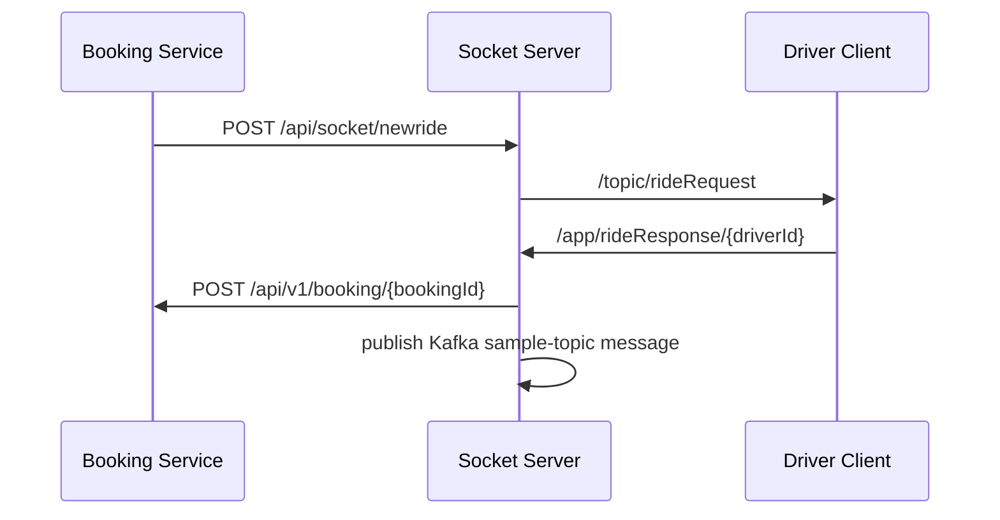

# RideFlow Socket Server

Socket Server is RideFlow's real-time communication service. It exposes a SockJS/STOMP endpoint, broadcasts new ride requests to connected drivers, accepts driver responses, and bridges those responses back to Booking Service.

It also contains Kafka producer/consumer wiring used by the current project for messaging experiments.

## Runtime

| Property | Value |
|---|---|
| Application name | `SocketServer` |
| Port | `3002` |
| WebSocket protocol | STOMP over WebSocket/SockJS |
| Service discovery | Eureka client |
| Kafka broker | `localhost:9092` |
| Database | MySQL / `uberdb` |
| Shared models | `Rideflow-EntityService:0.0.4-SNAPSHOT` |

## WebSocket Configuration

SockJS/STOMP endpoint:

```text
/ws
```

Application destination prefix:

```text
/app
```

Simple broker prefixes:

```text
/topic
/queue
```

Current endpoint configuration allows all origin patterns for local development:

```text
*
```

Restrict this in a deployed environment.

## Real-Time Ride Flow



## REST Endpoints

Base path:

```text
/api/socket
```

### Diagnostic / Kafka Publish

```http
GET /api/socket
```

Current behavior publishes:

```text
Hello
```

to:

```text
sample-topic
```

and returns:

```json
true
```

This is primarily a development/diagnostic endpoint.

### Broadcast New Ride

```http
POST /api/socket/newride
Content-Type: application/json
```

Example:

```json
{
  "passengerId": 1,
  "bookingId": 19
}
```

The server broadcasts the ride request to:

```text
/topic/rideRequest
```

Current implementation sends the request to all subscribers; filtering to only the supplied nearby-driver IDs is marked as a future improvement.

## STOMP Driver Response

Connected drivers send a response to:

```text
/app/rideResponse/{userId}
```

where `{userId}` is interpreted as the driver ID.

Example message body:

```json
{
  "response": true,
  "bookingId": 19
}
```

The handler currently builds:

```text
driverId = userId
status   = SCHEDULED
```

and calls Booking Service.

### Current Booking Callback

The checked-in implementation currently uses:

```text
http://localhost:8001/api/v1/booking/{bookingId}
```

rather than discovering Booking Service through Eureka.

That hardcoded callback is an important future refactoring target.

## Tech Stack

- Java 17
- Spring Boot 4.1.1
- Spring MVC
- Spring WebSocket
- STOMP
- SockJS
- Spring Cloud Netflix Eureka Client
- Spring Kafka
- Spring Data JPA
- Lombok
- Gradle
- shared RideFlow EntityService models

## Configuration

### Server

```properties
spring.application.name=SocketServer
server.port=3002
```

### Kafka

```properties
spring.kafka.bootstrap-servers=localhost:9092
spring.kafka.consumer.group-id=sample-group
spring.kafka.consumer.auto-offset-reset=earliest
```

### Eureka

```properties
eureka.client.service-url.defaultZone=http://localhost:8761/eureka/
eureka.instance.preferIpAddress=true
```

### Database

```properties
spring.datasource.url=jdbc:mysql://localhost:3306/uberdb
spring.datasource.username=root
spring.datasource.password=root
spring.jpa.hibernate.ddl-auto=update
```

## Prerequisites

- JDK 17+
- Eureka Service Discovery
- Kafka
- MySQL / `uberdb`
- required shared EntityService artifact
- Booking Service for the complete driver-response callback flow

## Suggested Startup Order

1. MySQL
2. Kafka
3. publish EntityService
4. Service Discovery
5. Socket Server
6. Booking Service

For the complete booking flow, Location Service and Redis are also required.

## Run

```bash
# Linux/macOS
./gradlew bootRun

# Windows
gradlew.bat bootRun
```

The REST/WebSocket server starts on:

```text
http://localhost:3002
```

The service should register in Eureka as:

```text
SOCKETSERVER
```

## STOMP Contract Summary

| Direction | Destination | Purpose |
|---|---|---|
| Server -> clients | `/topic/rideRequest` | broadcast a new ride request |
| Client -> server | `/app/rideResponse/{userId}` | driver accepts/responds to a booking |

The simple broker is also configured for `/queue`, enabling future user-specific/private messaging patterns.

## Project Structure

```text
src/main/java/com/rideflow/socketserver/
├── SocketServerApplication.java
├── Consumers/
│   ├── KafkaConsumerService.java
│   └── KafkaConsumerService1.java
├── Producers/
│   └── KafkaProducerService.java
├── configuration/
│   ├── KafkaConfig.java
│   ├── ScheduleConfig.java
│   └── WebSocketConfig.java
├── controller/
│   ├── DriverRequestController.java
│   └── TestController.java
├── dto/
└── models/
```

`TestController` currently contains commented experimental STOMP examples for ping, room chat and private chat.

## Current Implementation Notes

- `/topic/rideRequest` broadcasts to all subscribers.
- driver-response handling is synchronized.
- Booking Service callback is currently hardcoded to localhost.
- a `sample-topic` Kafka message is produced in the active controller flow.
- wildcard WebSocket origins are enabled for development.
- Springdoc/OpenAPI is not currently configured; WebSocket/STOMP contracts are documented here because Swagger does not model STOMP messaging well.

## Parent Project

[RideFlow](https://github.com/Abhilash-Panja/RideFlow)
